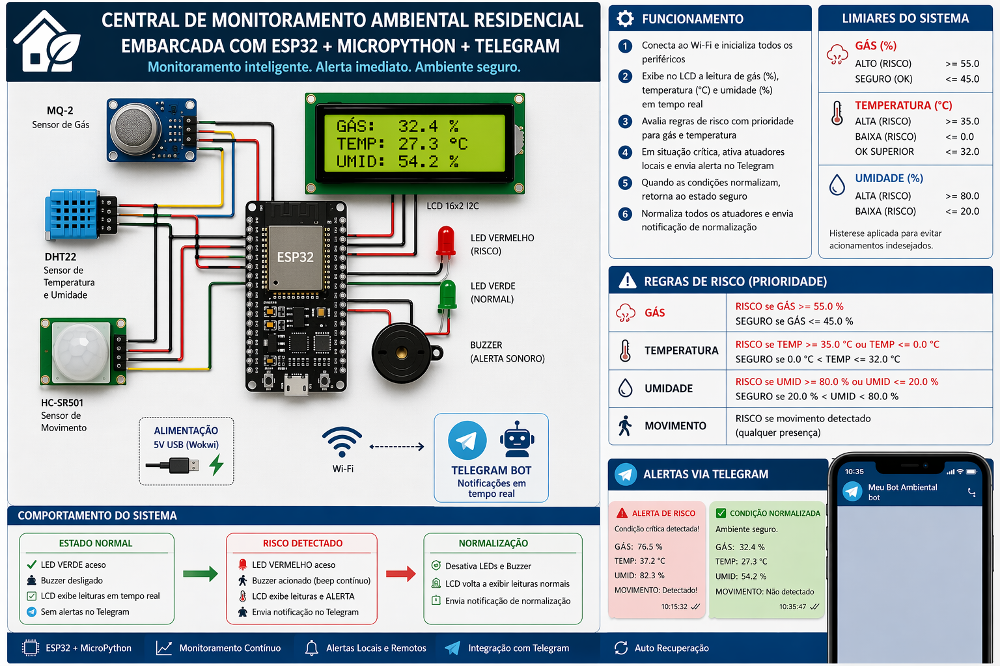
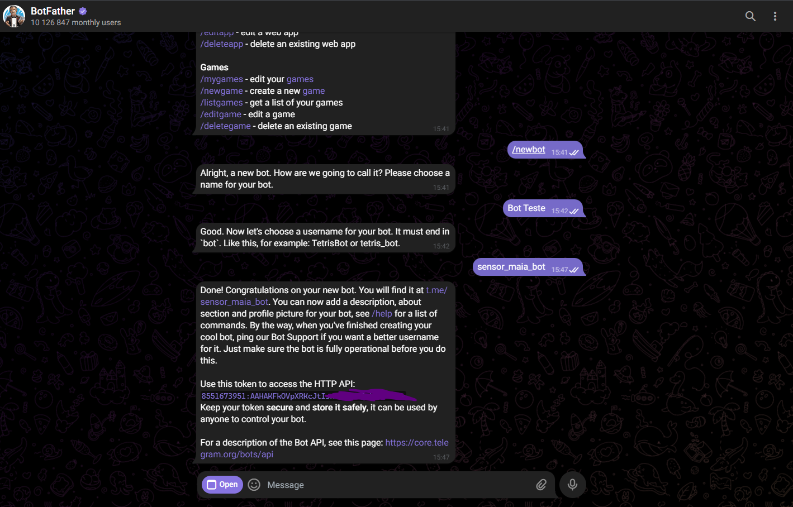
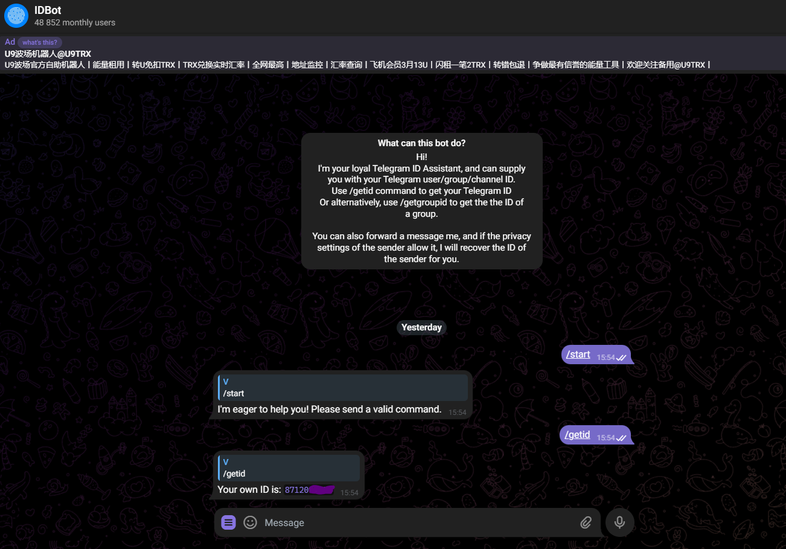
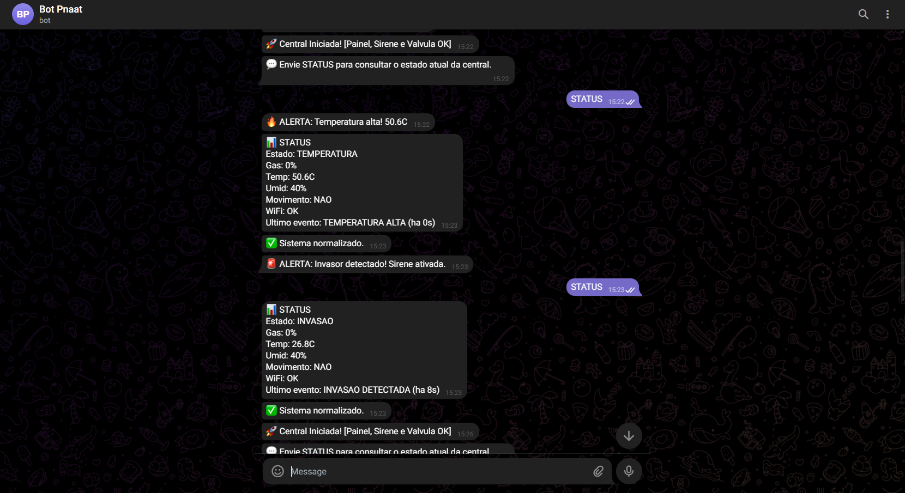
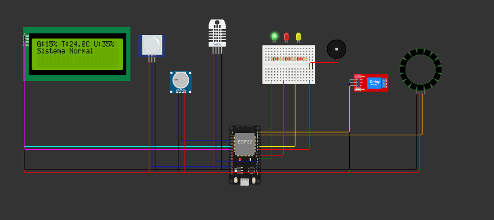

# Processo Seletivo – Intensivo Maker | IoT
## Etapa Prática – Sistemas Embarcados

Bem-vindo(a) à **etapa prática do processo seletivo para o Intensivo Maker | IoT**.

Esta atividade tem como objetivo avaliar suas competências em **Sistemas Embarcados**, com foco em **organização de projeto, lógica de firmware e simulação de hardware**, a partir da aplicação prática dos conhecimentos adquiridos nos cursos EAD da etapa anterior.

> 🎯 **Objetivo principal**  
> Avaliar sua capacidade de **planejar, estruturar e desenvolver** uma solução funcional de sistemas embarcados, seguindo boas práticas de engenharia.

---

## 🏁 Passo 0 – Antes de Tudo

Se você **nunca utilizou Git ou GitHub**, não se preocupe.  
Siga atentamente os passos abaixo — eles fazem parte do processo de aprendizagem esperado.

---

### 1️⃣ Criação de Conta no GitHub

1. Acesse: https://github.com  
2. Clique em **Sign up**  
3. Crie sua conta gratuita seguindo as instruções da plataforma  

> 📌 O GitHub será utilizado para:
> - Envio do seu projeto  
> - Versionamento do código  
> - Correção e validação automática via GitHub Actions  

---

### 2️⃣ Instalação do Git

O **Git** é a ferramenta responsável pelo controle de versões do seu código.

### Windows
Baixe e instale o **Git Bash**:  
https://git-scm.com/downloads

### Linux / macOS
Verifique se o Git já está instalado:

```bash
git --version
```
> Caso não esteja, instale pelo gerenciador de pacotes do seu sistema.

## ⚙ Passo 1 – Preparando o Ambiente

Para desenvolver o desafio, você deverá criar uma cópia deste repositório no seu GitHub.

### 1️⃣ Fork do Repositório
No canto superior direito desta página, clique em Fork


Uma cópia do repositório será criada no seu perfil do GitHub

> 🔎 O Fork permite que você trabalhe de forma independente, sem alterar o repositório original do processo seletivo.

### 2️⃣ Clone do Repositório

No repositório do seu Fork, clique em **<> Code**


Copie a URL e execute no terminal:

```bash
git clone https://github.com/SEU_USUARIO/nome-do-repositorio.git
cd nome-do-repositorio
```

> O comando git clone cria uma cópia local do repositório para desenvolvimento.

### 3️⃣ Preparação do Ambiente de Execução

Você pode executar o projeto de duas formas. Escolha apenas uma.

#### 🔹 Opção A – Ambiente Python Local

**Requisitos:**

- Python 3.10 ou 3.11
- pip

**Instale as dependências:**

```bash
pip install -r requirements.txt
```

#### 🔹 Opção B – Dev Container (Recomendado)

Este repositório inclui um Dev Container, garantindo um ambiente padronizado.

**Requisitos:**

- VS Code
- Docker instalado
- Extensão Dev Containers

**Passos:**

1. Abra o repositório no VS Code
2. Clique em "Reopen in Container"
3. Aguarde a criação automática do ambiente

> ➡️ Todas as dependências serão instaladas automaticamente.

## 🔐 Passo 2 – Criando sua API Key do Wokwi

A simulação do projeto será executada automaticamente via GitHub Actions, utilizando o Wokwi CLI.

Para isso, você precisa gerar uma API Key.

1. Acesse: https://wokwi.com/dashboard/ci
2. Faça login (Google ou GitHub)
3. Clique em Generate API Token
4. Copie a chave gerada (exemplo: wokwi-xxxxxxxx)

> ⚠️ Importante
> - Nunca faça commit dessa chave
> - Ela deve ser armazenada apenas como secret no GitHub

## 🔒 Passo 3 – Configurando a API Key no GitHub (Secrets)

**No repositório do seu Fork:**

1. Vá em Settings
2. Acesse Secrets and variables → Actions
3. Clique em New repository secret
4. Nome: WOKWI_API_KEY  // trocado por WOKWI_CLI_TOKEN devido ao ci.yml
5. Valor: sua chave gerada
6. Salve

> ✔️ As GitHub Actions do template já estão preparadas para usar essa variável automaticamente.


## 🧠 Passo 4 – Desafio Técnico

Você deverá desenvolver um projeto de sistemas embarcados simulados, utilizando Python e Wokwi.

### 📁 Estrutura mínima esperada

```text
/project
 ├── src/
 │   └── main.py        # Código principal do projeto
 ├── wokwi.toml         # Configuração da simulação
 ├── diagram.json       # Circuito no Wokwi
 └── README.md          # Explicação do seu projeto
```

> Você pode expandir essa estrutura se desejar, desde que mantenha os arquivos essenciais.

### 🛠 Como Desenvolver seu Projeto

O desenvolvimento acontece principalmente nos arquivos abaixo:

#### 1️⃣ src/main.py

- Código Python executado na simulação
- Implementa a lógica do sistema embarcado
- Exemplos: controle de LEDs, leitura de sensores, estados, temporizações, etc.

#### 2️⃣ diagram.json

- Define o hardware virtual do projeto
- Componentes como LEDs, botões, sensores e placa microcontroladora

#### 3️⃣ wokwi.toml

- Configura a simulação: tipo de placa, framework e dependências adicionais

#### 4️⃣ Commit e Push

Após suas alterações:

```bash
git add .
git commit -m "Descrição clara do que foi feito"
git push
```

### ⚙ Execução Automática (GitHub Actions)

A cada push, o GitHub Actions irá automaticamente:

- Executar o pipeline de build
- Rodar a simulação via Wokwi CLI
- Validar que o projeto executa sem erros

### 📌 Caso algo falhe:

- Vá até a aba Actions
- Analise os logs da execução
- Corrija e envie novamente

## 📊 Critérios de Avaliação

Esta etapa será avaliada considerando:

- Funcionamento correto da simulação
- Código organizado e legível
- Estrutura de arquivos correta
- Uso adequado do Wokwi
- Commits claros e bem descritos
- Projeto executando sem falhas nas Actions

---

## 📎 Submissão Final

Após concluir o desenvolvimento:

1. Verifique se o projeto **executa sem erros** nas GitHub Actions  
2. Confirme que todos os arquivos obrigatórios estão presentes  
3. Copie o link do **seu repositório no GitHub**

📤 Envie o link conforme as orientações do processo seletivo na plataforma **Moodle**.

---

## 📝 Relatório do Candidato

---

### 👤 Identificação do Candidato

- **Nome completo:** Valney Maia Neto
- **GitHub:** https://github.com/valneymaia/processoseletivoIoT-Valney-Maia.git

---


## 1️⃣ Visão Geral da Solução

O projeto é uma **central de monitoramento ambiental residencial** embarcada, simulada no Wokwi com ESP32 e MicroPython e integrada ao Telegram para alerta remoto em tempo real.

O sistema monitora continuamente três variáveis críticas do ambiente: **concentração de gás**, **temperatura** e **presença de movimento**. Quando qualquer condição de risco é detectada, aciona alertas visuais (LEDs), sonoros (buzzer), exibe mensagens no display LCD e envia notificações automáticas via Telegram Bot. Quando as condições voltam ao normal, o sistema se autorrecupera e normaliza todos os atuadores.

🎥 Demonstração em Vídeo
Vídeo de demonstração do projeto em funcionamento:
https://youtu.be/c7x9dHemi2E

Funcionamento em alto nível:

- Conecta ao Wi-Fi e inicializa todos os periféricos
- Exibe no LCD a leitura de gás (%) e temperatura (°C) em tempo real
- Avalia regras de risco com prioridade para gás e temperatura
- Em situação crítica, ativa atuadores locais e envia alerta no Telegram
- Quando as condições normalizam, retorna ao estado seguro com notificação de normalização


---

##  Passo 1.1 – Configuração do Telegram (BOT_TOKEN e CHAT_ID)

Para receber os alertas do sistema no celular, é necessário configurar dois campos no arquivo src/main.py:

- BOT_TOKEN
- CHAT_ID

### 1️⃣ Criar o bot e obter o BOT_TOKEN

Abra o BotFather no Telegram e execute o comando /newbot.
Ao final da criação, o Telegram retorna o token do bot.



### 2️⃣ Obter o CHAT_ID

Depois de criar o bot, envie uma mensagem para ele e recupere o seu chat id.
Esse valor deve ser usado no campo CHAT_ID no código.



### 3️⃣ Sistema funcionando com alertas no bot

Com BOT_TOKEN e CHAT_ID preenchidos, o sistema passa a enviar notificações de monitoramento e alertas automaticamente.

Também é possível consultar o estado atual em tempo real enviando `STATUS` (ou `/status`) para o bot no Telegram.


O retorno inclui:

- estado atual da central
- leituras de gás, temperatura e umidade
- presença de movimento
- status do Wi-Fi
- último evento crítico com tempo decorrido (ex.: "INVASAO DETECTADA (ha 8s)")



## Passo 1.2 – Geração do `fs.bin` (LittleFS)

Para o Wokwi carregar os arquivos do `src/`, é necessário gerar o `fs.bin` antes da simulação local.

Execute na raiz do projeto:

```bash
python src/build_fs.py
```

Esse script:

- cria uma imagem LittleFS
- empacota os arquivos presentes em `src/`
- atualiza o arquivo `fs.bin` na raiz do repositório


## 2️⃣ Arquitetura do Sistema Embarcado

O firmware é estruturado em torno de um **loop principal não-bloqueante**, com controle de tempo via `ticks_ms()` para evitar o uso excessivo de `sleep` bloqueante.

**Fluxo principal do `main.py`:**

```
Inicialização
    └── Configura pinos (LEDs, buzzer, relé de gás e anel NeoPixel)
    └── Inicializa sensores (DHT22, ADC gás, PIR)
    └── Inicializa LCD via I2C
    └── Conecta ao WiFi
    └── Envia mensagem inicial no Telegram

Loop Principal (não-bloqueante)
    ├── Leitura DHT22 (a cada 2000ms via ticks_diff)
    ├── Leitura ADC do gás (média de 30 amostras)
    ├── Captura de presença por IRQ + debounce + latch temporal (PIR)
    ├── Polling de comandos Telegram (STATUS ou /status)
    ├── Atualização do LCD (linha 0 = leituras em tempo real)
    └── Máquina de estados:
            ├── INVASÃO   → sirene pulsante + anel vermelho + Telegram
            ├── GÁS       → relé de gás + sirene pulsante + anel vermelho + Telegram
            ├── TEMPERATURA (alta/baixa) → LED vermelho + Telegram
            ├── UMIDADE (alta/baixa) → LED amarelo + aviso local
            └── NORMAL    → LED verde + reset dos atuadores + Telegram de normalização
```

Interação entre componentes:

- **Entradas:** ADC de gás (GPIO34), DHT22 (GPIO4), PIR (GPIO13)
- **Saídas locais:** buzzer (GPIO18), LED verde (GPIO16), LED vermelho (GPIO17), LED amarelo (GPIO19), relé de gás (GPIO26), anel NeoPixel (GPIO25)
- **Interface:** LCD I2C (SCL GPIO22, SDA GPIO21)
- **Comunicação externa:** API Telegram para alarmes e normalização

---

## 3️⃣ Componentes Utilizados na Simulação

| Componente | ID | Função |
|---|---|---|
| ESP32 DevKit V1 | `esp` | Microcontrolador principal |
| LCD 2004 I2C | `lcd1` | Exibição de leituras e alertas em tempo real |
| DHT22 | `dht1` | Leitura de temperatura (pino D4) |
| Potenciômetro | `pot1` | Simulação do sensor de gás via ADC (pino D34) |
| Sensor PIR | `pir1` | Detecção de movimento (pino D13) |
| LED Verde | `led_g` | Indica estado normal do sistema (pino D16) |
| LED Vermelho | `led_r` | Indica estado de alerta (pino D17) |
| LED Amarelo | `led_y` | Indica aviso de umidade fora da faixa (pino D19) |
| Relé | `relay1` | Simula acionamento de válvula de gás (pino D26) |
| Anel NeoPixel (16 LEDs) | `ring1` | Sinalização visual intensa para gás/invasão (pino D25) |
| Buzzer | `bz1` | Alarme sonoro em situações de perigo (pino D18) |
| Resistores 220Ω | `r1`, `r2`, `r3` | Limitação de corrente dos LEDs |
| Mini Breadboard | `bb1` | Organização das conexões dos atuadores |

---
### 🧩 Diagrama no Wokwi

Abaixo está o diagrama completo da montagem utilizada na simulação:



## 4️⃣ Decisões Técnicas Relevantes

- **Temporização não-bloqueante:** a leitura do DHT22 é controlada por `time.ticks_diff()`, garantindo que o loop principal continue fluindo sem travar aguardando o sensor.
- **Média de amostras no ADC:** o sensor de gás faz 30 leituras consecutivas e calcula a média antes de tomar decisões, reduzindo ruído e leituras espúrias.
- **Máquina de estados explícita:** `ESTADO_NORMAL`, `ESTADO_INVASAO`, `ESTADO_GAS`, `ESTADO_TEMP` e `ESTADO_UMIDADE` organizam melhor a lógica de transição e as ações de cada cenário.
- **Prioridade de alarmes:** a lógica usa hierarquia explícita via `if/elif` (`GAS` > `TEMPERATURA` > `INVASAO` > `UMIDADE`) para tratar primeiro os eventos mais críticos.
- **PIR robusto (IRQ + debounce + latch):** o movimento é capturado por interrupção de borda, confirmado por debounce e mantido por janela temporal para não perder pulsos curtos da simulação.
- **Retenção controlada de invasão:** a invasão é mantida por alguns segundos após a detecção e só é renovada com novo evento real, evitando "estado preso".
- **Sirene pulsante:** alternância de frequência no buzzer para alertas de gás/invasão, aumentando percepção de criticidade.
- **Consulta remota por Telegram:** o comando `STATUS`/`/status` retorna o quadro atual e o último evento crítico com tempo decorrido.
- **Driver LCD customizado:** a classe `MiniLCD` implementa o protocolo I2C do LCD 2004 em MicroPython puro, sem dependências externas, tornando o projeto mais portável.
- **Tratamento de exceção no Telegram:** a função de envio captura erros de rede sem interromper o firmware, garantindo resiliência em caso de perda de conectividade.

---

## 5️⃣ Resultados Obtidos

O sistema funciona conforme esperado na simulação do Wokwi:

- LCD exibe em tempo real gás, temperatura e umidade
- Potenciômetro simula variações do sensor de gás de forma contínua
- Ao ultrapassar 55% de gás, o relé de gás é acionado, o anel fica vermelho e a sirene entra em modo pulsante
- Sensor PIR detecta movimento e aciona alerta de invasão quando não há alerta mais crítico ativo
- Pulsos curtos de movimento no PIR são capturados com maior confiabilidade na simulação (sem necessidade de múltiplos cliques)
- Temperaturas acima de 35°C ou abaixo de 0°C disparam alertas específicos
- Umidade fora da faixa de 20% a 80% aciona aviso local (LED amarelo + bip curto)
- Quando as condições voltam ao normal, os atuadores são desligados, o sistema retorna ao LED verde e envia notificação de normalização
- O comando `STATUS`/`/status` no Telegram responde com o estado atual e o último evento crítico com tempo decorrido
- Notificações Telegram enviadas corretamente no início da operação, entrada em alerta e retorno à normalidade

---

## 6️⃣ Comentários Adicionais

**Dificuldades encontradas:**  
O principal desafio foi o fluxo de build do projeto. O Wokwi com MicroPython depende de um arquivo `fs.bin` (sistema de arquivos LittleFS) para carregar o `main.py` na simulação. O repositório base não incluía esse arquivo, o que exigiu a criação de um script auxiliar (`build_fs.py`) para empacotar os arquivos do `src/` no binário antes de cada execução local.

**Limitações atuais:**
- Dependência de execução manual do `build_fs.py` antes de simulação local
- Sem persistência local de histórico de eventos críticos
- Dependência de conectividade para alertas remotos

**Melhorias propostas:**
- Automatizar geração do `fs.bin` no fluxo local (ex.: task do VS Code ou script único de run)
- Ajustar calibração dos limiares de umidade e gás para diferentes ambientes
- Incluir fila local de eventos com reenvio quando a rede voltar

**Principais aprendizados:**  
A importância de entender o pipeline completo de um projeto embarcado, desde o build do firmware até a execução em CI/CD via GitHub Actions, e o valor de combinar supervisão local e remota em sistemas IoT.

---

> ✅ Este relatório faz parte da avaliação técnica.  
> Clareza, objetividade e organização são tão importantes quanto o funcionamento do código.

---

## 🆘 Suporte

Em caso de dúvidas:

- Consulte o material dos cursos EAD
- Leia atentamente este README
- Analise os logs das GitHub Actions
- Utilize os canais oficiais para contato com os instrutores

Boa sorte no processo seletivo.  
Mostre sua capacidade de pensar como um engenheiro de sistemas embarcados.